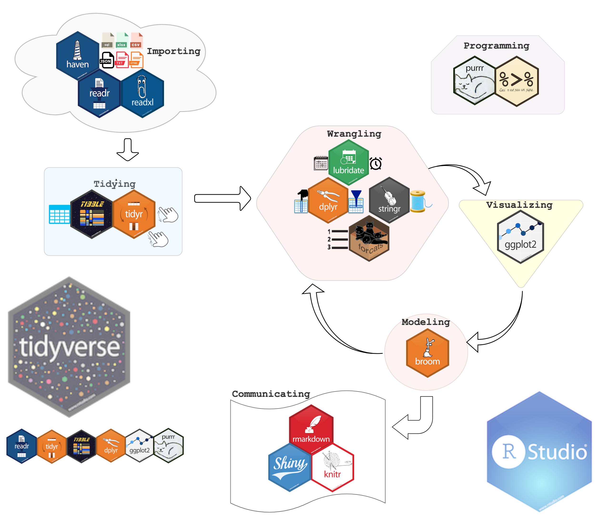

```{r setup, echo=FALSE, message = FALSE, warning = FALSE}
knitr::opts_chunk$set(echo = FALSE)
knitr::opts_chunk$set(message = FALSE)
knitr::opts_chunk$set(warning = FALSE)
options(htmltools.dir.version = FALSE)

library(kableExtra)

library(tidyverse)
library(scales)
library(stringr)
library(lubridate)
library(patchwork)

library(tidytext)
library(wordcloud)
library(ggraph)
library(igraph)

# Function to add colored text to the document

colorize <- function(x, color) {
  if (knitr::is_latex_output()) {
    sprintf("\\textcolor{%s}{%s}", color, x)
  } else if (knitr::is_html_output()) {
    sprintf("<span style='color: %s;'>%s</span>", color, 
      x)
  } else x
}

# Function for visualizing Bi-grams

visualize_bigrams <- function(bigrams) {
  set.seed(2020)
  a <- grid::arrow(type = "closed", length = unit(.15, "inches"))
  
  bigrams %>%
    graph_from_data_frame() %>%
    ggraph(layout = "fr") +
    geom_node_point(color = "lightblue", size = 3) +
    geom_edge_link(aes(edge_alpha = n), show.legend = FALSE, arrow = a) +
    geom_node_text(aes(label = name), vjust = 1, hjust = 1) +
    theme_void()
}
```

layout: true

background-image: url(img/hexlogo.png)
background-size: 65px 75px
background-position: 0.5% 1%

---


# Overview

- ### What is *Data Analysis*?

- ### Why use open source tools (R or Python)?

- ### Example analyses using amusement park data

---
class: inverse, center, middle

# What is Data Analysis?

---
# Data Analysis

**According to [wikipedia](https://en.wikipedia.org/wiki/Data_analysis):** Data analysis is a process of `r colorize("inspecting", "blue")`, `r colorize("cleansing", "blue")`, `r colorize("transforming", "blue")`, and `r colorize("modeling", "blue")` data with the goal of discovering useful information, informing conclusion and supporting decision-making.

.center[]

### Otherwise: `r colorize("Garbage in --> Garbage out", "red")`

.footnote[
[1] This chart comes from the R for Data Science [(R4DS) book](https://r4ds.had.co.nz/) by *Garrett Grolemund* and *Hadley Wickham*
]


---
class: inverse, center, middle

# Open Source Software

---
# Open Source Software
<br>
<br>
--
.pull-left[]

--
.pull-right[]

---

# Why use R?

```{r, echo = FALSE, fig.align = "center", out.width = "80%"}

```

---

# *#Tidy Tuesday*

- #### *Tidy Tuesday* is a safe and supportive forum to practice wrangling and data visualizations.

- #### Every monday, new datasets are uploaded to [github](www.github.com) and the community practices.

- #### These particular data (Amusement Park Injuries) are from the 10 September 2019 [#TidyTuesday](https://github.com/rfordatascience/tidytuesday). 

---
background-image: url(img/tidyverse_stickers.png)
background-size: 100% 100%
background_position: 50% 50%

---

# Importing and Tidying
These data contain a lot free text, some inconsistent NAs (n/a, N/A) and dates (ymd, dmy). A good chance to do some data cleaning and then take a look at frequency, incident types, injury types, and accident types using free text analysis.

```{r pulling in these data, echo = FALSE, message = FALSE}
safer_parks <- readr::read_csv("https://raw.githubusercontent.com/rfordatascience/tidytuesday/master/data/2019/2019-09-10/saferparks.csv")
```
---

# Importing and Tidying

The safer_parks dataset contains `r nrow(safer_parks)` incidents that were recorded from `r n_distinct(safer_parks$bus_type)` different types of parks. Below is a table containing the number on incidents according to the type of parks.

```{r Incidents by business type, echo = FALSE}
safer_parks %>% 
  count(`Park Type` = bus_type, sort = TRUE, name = "Number of Incidents") %>% 
  kable() %>% kable_styling(bootstrap_options = "striped", full_width = FALSE) %>% 
  scroll_box(height = "300px") 
```

---

background-image: url(img/tidyverse_stickers.png)
background-size: 100% 100%
background_position: 50% 50%

---

# Wrangling
For this analysis, I will focus on the amusement park industry. The first thing I did was filter these data to only include incidents from either an *Amusement park* or *Carnival or rental* when the industry sector was listed as *amusement ride*. 

```{r data filtering, echo = FALSE}
dat <- safer_parks %>% 
  filter(bus_type %in% c("Amusement park", "Carnival or rental") &
                              industry_sector == "amusement ride") %>% 
  mutate(acc_date = mdy(acc_date), 
         month = factor(month(acc_date, label = TRUE, abbr = TRUE)),
         manufacturer = ifelse(is.na(manufacturer), "Unknown", manufacturer),
         category2 = ifelse(str_detect(category, ":"),
                             str_extract(category, "^([^:])+"), category),
         category2 = ifelse(str_detect(category, "Illness"),
                             "Illness", category2))
```

The resulting dataset contains **`r nrow(dat)`** incidents that we will analyze further.
---
background-image: url(img/tidyverse_stickers.png)
background-size: 100% 100%
background_position: 50% 50%

---
# Visualizing
.pull-left[
```{r type of injury, echo = FALSE, message = FALSE, warning = FALSE}
dat %>% 
  count(category2) %>% 
  mutate(category2 = fct_reorder(category2, n)) %>% 
  top_n(n=10) %>%
  ggplot(aes(category2, n, fill = category2)) + 
  geom_col(show.legend = FALSE) + 
  coord_flip() + 
  scale_fill_grey(start = 0.8, end = 0.3) +
  labs(x = NULL, 
       y = "Number of Incidents",
       title = "Ten Most Common Types of Incidents",
       subtitle = "Reported for amusement rides")
```
]
.pull-right[
```{r state population data}
st_crosswalk <- tibble(state = state.name) %>%
  bind_cols(tibble(abb = state.abb))

state_pop <- as_tibble(tidycensus::get_decennial(geography = "state", 
                           variables = "P001001") %>% select(state = NAME, pop = value)) %>% 
  left_join(st_crosswalk, by = "state") %>% select(state = abb, pop)

state_dat <- left_join(dat%>% count(acc_state), state_pop, by = c("acc_state" = "state"))

state_dat %>% 
  mutate(incident_per_100k = ((n / pop)*100000),
         acc_state = fct_reorder(acc_state, incident_per_100k)) %>% 
  top_n(n=10) %>%
  ggplot(aes(acc_state, incident_per_100k, fill = acc_state)) + 
  geom_col(show.legend = FALSE) + 
  coord_flip() + 
  scale_fill_grey(start = 0.8, end = 0.3) +
  labs(x = "State", 
       y = "Number of Incidents per 100k",
       title = "Ten states with highest per-capita incidents",
       subtitle = "Reported for amusement rides")
```
]

---

# Visualizing

.center[
```{r timeline, echo = FALSE}
p1 <- dat %>%  
  count(acc_date) %>% 
  ggplot(aes(acc_date, n)) +
  geom_line(color = "red") +
  scale_x_date(date_breaks = "years" , date_labels = "%Y") +
  labs(x = "Date of incident",
       y = "Number of incidents",
       title = "Seasonality of incidents")

p2 <- dat %>%  
  count(month) %>% 
  ggplot(aes(month, n)) +
  geom_col() +
  labs(x = NULL,
       y = "Number of incidents",
       title = "Month when incidents occur")

(p1 / p2)
```
]
---


# Visualizing

.pull-left[
```{r Manufacturer}
dat %>% 
  count(manufacturer, sort = TRUE) %>% 
  mutate(manufacturer = fct_reorder(manufacturer, n)) %>% 
  top_n(n = 10) %>% 
  ggplot(aes(manufacturer, n, fill = manufacturer)) + 
  geom_col(show.legend = FALSE)+ 
  coord_flip() +
  scale_fill_grey(start = 0.8, end = 0.3) + 
  labs(x = "Manufacturer",
       y = "Number of incidents",
       title = "Ten manufacturers with the highest reported incidents")
```
]
.pull-right[
```{r Mechanical}
dat %>%  
  filter(mechanical == 1) %>% 
  count(manufacturer) %>% 
  mutate(manufacturer = fct_reorder(manufacturer, n)) %>% 
  top_n(n = 10) %>% 
  ggplot(aes(manufacturer, n, fill = manufacturer)) + 
  geom_col(show.legend = FALSE) + 
  coord_flip() + 
  scale_fill_grey(start = 0.8, end = 0.3) + 
  labs(x = "Manufacturer",
       y = "Number of mechanical incidents",
       title = "Ten manufacturers with the highest reported mechanical incidents")
```
]

---
background-image: url(img/tidyverse_stickers.png)
background-size: 100% 100%
background_position: 50% 50%

---

# Modeling

- ### We can do free text analysis using the [{tidytext}](https://www.tidytextmining.com/) package

    - #### Tokenize these data

    - #### Remove common words

    - #### Visualize through BarPlot, WordCloud, or Bi-Gram Graph
    
---

### Modeling (Accident Text Analysis)-BarPlot

```{r acc tokenization}
acc_tokens <- dat %>% 
  select(acc_id, acc_desc) %>% 
  unnest_tokens(word, acc_desc) %>% 
  filter(is.na(as.numeric(word)))

data(stop_words) 
my_stop_words <- c("patron", "ride", "stated", "riding", "pain", "attraction")

acc_tokens <- acc_tokens %>% anti_join(stop_words) %>% filter(!word %in% my_stop_words)
```

```{r acc barplot}
acc_tokens %>% count(word, sort = TRUE) %>% 
  mutate(word = fct_reorder(word, n)) %>% 
  slice(1:20) %>% 
  ggplot(aes(x = word, y = n, fill = word)) + 
  geom_col(show.legend = FALSE) +
  coord_flip() +
  scale_fill_grey(start = 0.8, end = 0.3) + 
  labs(x = "", y = "Number of incidents",
       title = "Twenty most common reported words in the accident description")
```

---
### Modeling (Accident Text Analysis)-WordCloud
.center[
```{r acc wordcloud}
acc_tokens %>% count(word) %>% with(wordcloud(word, n, max.words = 100, colors =  c( "#56B4E9", "#E69F00")))
```
]
---
### Modeling (Accident Text Analysis)-Bi-Gram

```{r}
acc_bigrams <- dat %>%  
  unnest_tokens(bigram, acc_desc, token = "ngrams", n = 2)
  
acc_bigrams_sep <- acc_bigrams %>% 
  separate(bigram, c("word1", "word2"), sep = " ")

acc_bigrams_filtered <- acc_bigrams_sep %>% 
  filter(!word1 %in% c(stop_words$word, my_stop_words),
         !word2 %in% c(stop_words$word, my_stop_words),
         !is.na(word1),
         is.na(as.numeric(word1)),
         is.na(as.numeric(word2)))

acc_bigrams_filtered %>% 
  unite(bigram, word1, word2, sep = " ") %>% 
  count(bigram, name = "number_of_incidents", sort = TRUE) %>% 
  kable() %>% 
  kable_styling(bootstrap_options = "striped", full_width = FALSE) %>% 
  scroll_box(height = "400px")
```

---
### Modeling (Accident Text Analysis)-Bi-Gram

```{r acc bigram graph, fig.align = "center", out.width = '70%'}
acc_bigrams_filtered %>% 
  count(word1, word2, sort = TRUE) %>% 
  filter(n > 5)  %>% 
  visualize_bigrams()
```

---
### Modeling (Accident Text Analysis)

.center[
```{r acc by device_category}
acc_bigrams_unite <- acc_bigrams_filtered %>% 
  unite(bigram, word1, word2, sep = " ")

manuf_of_interest <- acc_bigrams_unite %>% 
  count(manufacturer, sort = TRUE) %>% 
  filter(manufacturer != "Unknown") %>% 
  slice(1:5)

acc_bigrams_unite %>% 
  count(device_category, bigram, sort = TRUE) %>% 
  arrange(device_category, desc(n)) %>% 
  group_by(device_category) %>% 
  slice(1:6) %>%
  ungroup() %>% 
  mutate(device_category = as.factor(device_category),
         bigram = reorder_within(bigram, n, device_category)) %>% 
  ggplot(aes(bigram, n, order = -n, fill = device_category)) + 
  geom_col(show.legend = FALSE) +
  scale_x_reordered() +
  labs(x = NULL, y = "Number of Incidents", 
       title = "Most common accidents reported by device types",
       subtitle = "Analyzing ride categories with six most reported incidents") + 
  facet_wrap(~device_category, ncol = 2, scales = "free") + 
  coord_flip() 
```
]
---

background-image: url(img/tidyverse_stickers.png)
background-size: 100% 100%
background_position: 50% 50%

---

# Communicating

- #### Strength of using R as opposed to other software
- #### RMarkdown, Blogdown, Bookdown, etc. make it simple to create reproducable reporting
- #### These analyses and  [xaringan slides](https://github.com/yihui/xaringan) were produced only using R
- #### So was this awesome <sup>2</sup> [website](https://andrewfarina.com/post/amusement_park_injuries/)

.footnote[
[2] awesome may be a biased view of my own website!
]

